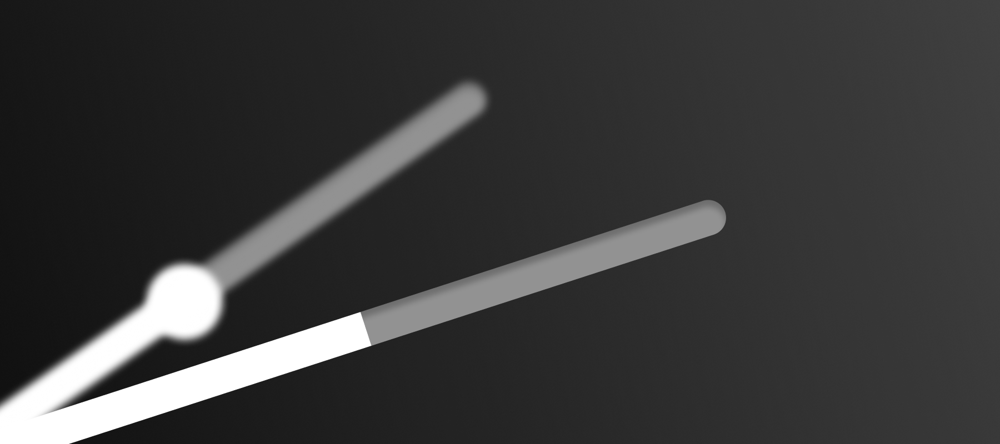
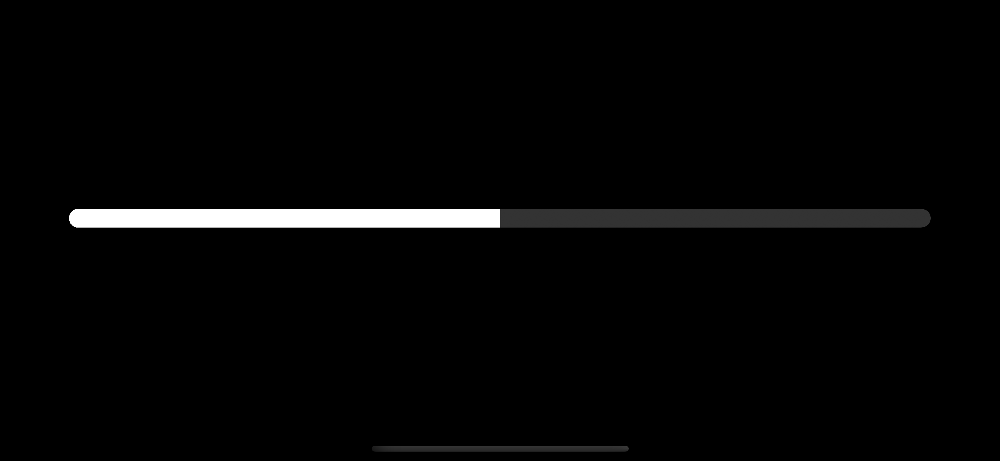
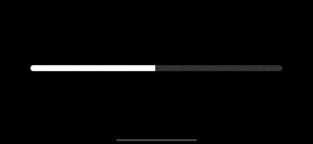

# SeekBar



The `SeekBar` component made with SwiftUI is designed to facilitate the easy display and manipulation of progress in video or audio players. It can also be used as a simple Slider.

## 🧬 Samples
If you want to see a sample usecase of a SeekBar, please check out the [SeekBarSamples](https://github.com/kim-minseong/SeekBarSamples)

## Usage

Create a SeekBar like this:
```swift
import SwiftUI
import SeekBar

struct YourView: View {
    @State private var value = 0.5
   
    var body: some View {
        SeekBar(value: $value)
    }
}
```


Additionally, you can create a SeekBar with buffered values for video or audio:
```swift
import SwiftUI
import SeekBar

struct YourView: View {
    @State private var value = 0.5
    @State private var bufferedValue = 0.6
    
    var body: some View {
        SeekBar(value: $value, bufferedValue: bufferedValue)
    }
}
```


## Customization

### Color

Add a `handleColors` or `trackColors` modifier to your SeekBar.

`handleColors` - Set the colors of the handle.<br>
`trackColors` - Set the colors of the track.

```swift
SeekBar(value: $value)
    .handleColors(handleColor: .blue)
    .trackColors(activeTrackColor: .indigo)
```


### Dimensions

`handleDimensions` - Set the dimensions of the handle, like size.<br>
`trackDimensions` - Set the dimensions of the track, such as height and corner radius.

```swift
SeekBar(value: $value)
    .handleDimensions(handleSize: 24)
    .trackDimensions(trackHeight: 16)
```


### Appearance

`seekBarDisplay` - Set the display mode for the SeekBar to show either the handle or only the track.
```swift
SeekBar(value: $value)
    .trackDimensions(
        trackHeight: 16,
        inactiveTrackCornerRadius: 16
    )
    .seekBarDisplay(with: .trackOnly)
```


### Interactive

`seekBarInteractive` - Interaction with the track or only the handle.<br>
`seekBarTrackAction` - Action performed when clicking on the SeekBar's track.

```swift
SeekBar(value: $value)
    .trackDimensions(
        trackHeight: 16,
        inactiveTrackCornerRadius: 16
    )
    .seekBarTrackAction(with: .moveWithValue)
```


### Animate with

You can create animations by combining onEditingChange with appearance changes:

```swift
@State private var isEditing = false

SeekBar(
    value: $value,
    onEditingChanged = { edited in
        withAnimation {
            isEditing = edited
        }
    }
)
.trackColor(activeTrackColor: isEditing ? .red : .white)
.handleSize(handleSize: isEditing ? 12 : 0)
```


Or like this:

```swift
@State private var isEditing = false

SeekBar(
    value: $value,
    onEditingChanged = { edited in
        withAnimation {
            isEditing = edited
        }
    }
)
.seekBarDisplay(with: .trackOnly)
.trackDimensions(
    trackHeight: isEditing ? 24 : 16,
    inactiveTrackCornerRadius: 24
)
.padding(.horizontal, isEditing ? 12 : 24)
```



## Installation

### Swift Package Manager

```swift
dependencies: [
    .package(url: "https://github.com/kim-minseong/SeekBar.git")
]
```

## Requirements

* iOS 15+
* Xcode 12+

## License
```
MIT License

Copyright (c) 2024 Minseong Kim

Permission is hereby granted, free of charge, to any person obtaining a copy
of this software and associated documentation files (the "Software"), to deal
in the Software without restriction, including without limitation the rights
to use, copy, modify, merge, publish, distribute, sublicense, and/or sell
copies of the Software, and to permit persons to whom the Software is
furnished to do so, subject to the following conditions:

The above copyright notice and this permission notice shall be included in all
copies or substantial portions of the Software.

THE SOFTWARE IS PROVIDED "AS IS", WITHOUT WARRANTY OF ANY KIND, EXPRESS OR
IMPLIED, INCLUDING BUT NOT LIMITED TO THE WARRANTIES OF MERCHANTABILITY,
FITNESS FOR A PARTICULAR PURPOSE AND NONINFRINGEMENT. IN NO EVENT SHALL THE
AUTHORS OR COPYRIGHT HOLDERS BE LIABLE FOR ANY CLAIM, DAMAGES OR OTHER
LIABILITY, WHETHER IN AN ACTION OF CONTRACT, TORT OR OTHERWISE, ARISING FROM,
OUT OF OR IN CONNECTION WITH THE SOFTWARE OR THE USE OR OTHER DEALINGS IN THE
SOFTWARE.
```
